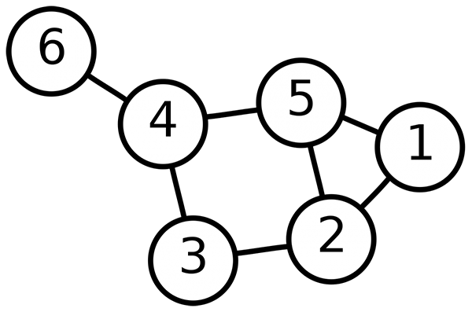
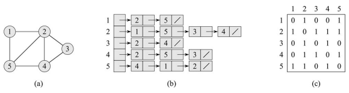
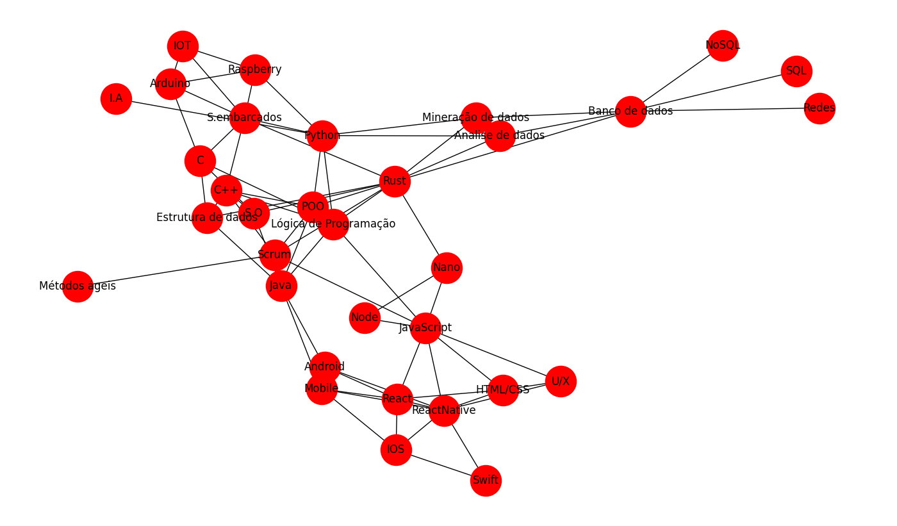
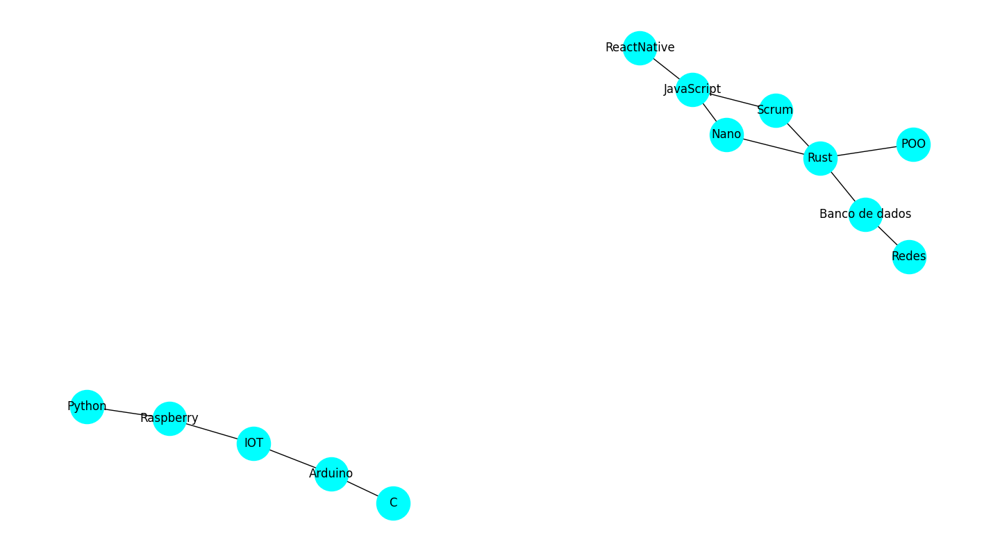
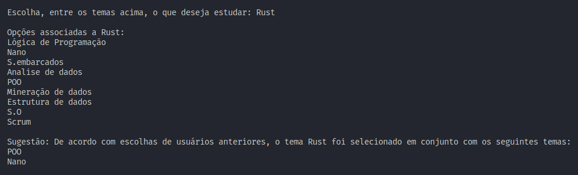

# Algoritmo de sugestão de livros de estudos baseado em escolhas de temas relacionados a tecnologia


 
## Conteúdos
 
<p align="center">
   <a href="#apresentação">Apresentação</a> •
   <a href="#introdução">Introdução</a> •
   <a href="#estrutura-de-dados-grafos">Estrutura de dados Grafos</a> •
   <a href="#aplicação">Aplicação</a> •
   <a href="#conclusão">Conclusão</a> •
   <a href="#bibliotecas">Bibliotecas</a> •
   <a href="#execução-do-projeto">Execução do projeto</a> •
   <a href="#referências">Referências</a> •
   <a href="#autor">Autor</a>
 
</p>
 
---
 
## Apresentação
 
Foi proposto pelo professor [Michel Pires da Silva](http://lattes.cnpq.br/1449902596670082) da matéria de `Arquitetura e Estruturas de Dados 2 do 4º Período do curso de Engenharia de Computação` um trabalho relacionado ao conteúdo passado em suas aulas teóricas que são `Estruturas de dados Grafos`, onde tinha o propósito de implementar alguma aplicação que envolvia estruturas de representação e caminhamento em grafos, a partir disso foi designado a seguinte proposta para desenvolvimento em dupla de alunos:
 
*Neste trabalho o objetivo é aplicar as estruturas em grafos para solucionar um problema real qualquer. Cada dupla de alunos deve escolher em literatura uma das áreas de aplicação do tema e propor uma solução baseada nos conceitos apresentados. Essa solução pode ser realizada utilizando C, C++ e/ou Python. O objetivo é mostrar a atuação de algoritmos clássicos em grafos na resolução de problemas emergentes. Alguns temas para inspiração são: Análise de rede social, rotas de entregas, análise de trafego (i.e., carros, pacotes na internet, etc), mínima quantidade de saltos em redes, teoria dos jogos, elaboração de horário vs rodízio de salas, envoltória convexa (do inglês, convex hull), etc.*
 
*LAB AEDS: Espera-se que os trabalhos estejam muito bem organizados em termos de estruturação de código. O código deve estar devidamente documentado. Para tanto, é obrigatório a utilização de diretrizes de comentários que possibilitem a geração automática de documentação.*
 
*AEDS: O problema abordado deve ser explicado em detalhes, considerando todo referencial teórico sobre o tema abordado. Por exemplo, se o tema for caminho mínimo, é esperado que os autores explorem a área relatando os algoritmos clássicos existentes para tal problema, bem como, todo embasamento teórico matemático que detalha o contexto de atuação / solução. Esse documento deve ser entregue em formato README ou Wiki, ambos como parte do git do projeto.*
 
*Observação:  Como o tema grafos é imenso, cada dupla deve escolher um tema exclusivo, o qual não poderá ser abordado por outra equipe através da mesma solução. Por exemplo, se a dupla optar por calcular o caminho mínimo de cada vértice para todos os outros utilizando o algoritmo de floyd-warshall para um problema real qualquer, outras equipes não poderão adotar o mesmo algoritmo no mesmo problema. Contudo, o problema pode ser abordado por outras equipes adotando-se para isso outros algoritmos. Além disso, fica liberado para todas as equipes a utilização de conceitos de heurística, meta-heurística, computação evolutiva, etc. Por fim, caso haja mais de uma equipe atuando sob o mesmo problema, porém com soluções distintas, se essas elaborarem um git a parte com todas as soluções e um comparativo entre elas, discutindo profundamente ganhos, perdas e motivos pelos quais os ganhos no algoritmo X são obtidos, essas equipes ficam liberadas de realizar a metade da prova final. Lembrem-se, para esse ponto final de comparação, caso a linguagem utilizada não seja exatamente a mesma, a discussão de ganho vs performance deve considerar as peculiaridades da linguagem, para assim, tornar a comparação justa. Logo, é sugerido que para fins de justiça todos os algoritmos sejam executados na mesma plataforma computacional. Para agilizar o trabalho sem precisar centralizar o trabalho em um mesmo computador, considerem utilizar o Google Colab durante o desenvolvimento ou outra ferramenta que execute on-line. Assim, teremos o tempo justo extraído ao final.*
 
Dada a proposta, foi pensado no desenvolvimento de um algoritmo que buscava sugerir livros para auxiliar no estudo de usuários, sendo essa sugestão baseada em escolhas feitas durante a execução do programa com os temas relacionados a partir de um grafo, obtendo êxito no desenvolvimento baseado nos detalhes presentes nos tópicos abaixo:
 
---
 
## Introdução
 
Para introduzir o projeto foi pesquisado diversos tipos de algoritmos para sugestão, onde a partir dessas pesquisas foi encontrado algoritmos de filtragem com seus diferentes tipos, métodos utilizados em algoritmos de sugestão como por exemplo utilizando regras de associação, distância euclidiana e diversos outros que possui uma fácil aplicação em Python. Diante disso foi pensado em desenvolver o próprio algoritmo de sugestão a partir da <a href="#estrutura-de-dados-grafos">Estrutura de dados Grafos</a>.
 
A utilização da `Estrutura de dados Grafos` foi feita utilizando um pacote Python chamado **_NetworkX_** onde foi permitida a manipulação dos grafos utilizados no projeto, possibilitando atingir a proposta do código. A documentação da biblioteca, além de exemplos mais aprofundados, estão disponíveis em https://networkx.org/ e para o aprendizado nas manipulações desses grafos utilizando essa biblioteca foi consultado [3].
 
A `Estrutura de Dados Grafos` foi utilizada de duas maneiras diferentes nesse projeto. A sua primeira utilização surgiu no ínicio do código onde houve a necessidade de mostrar a possibilidade de escolha de temas para os usuários e a partir disso mostrar os temas relacionados de acordo com a sua escolha, o primeiro grafo então surgiu com a montagem de uma lista de adjacência com os temas e suas relações com outros diversos temas em um arquivo do tipo *__.csv__* e diante disso foi feita a leitura desse arquivo e então construído o grafo com os temas e suas relações. A segunda utilização foi feita já no meio do projeto onde diante das escolhas do usuário era montado um grafo com as relações dessas escolhas, com isso a cada escolha, se houvesse relações já feitas em execuções anteriores, é sugerido ao usuário opções que já foram relacionadas com base em execuções anteriores através desse grafo que ao final de cada execução faz uma lista de adjacência em um outro arquivo para que seja feita a verificação.
 
<i>• Todas as utilizações referente a estrutura de dados Grafos serão detalhadas mais à frente no tópico <a href="#aplicação">Aplicação</a> para que haja um melhor entendimento do projeto •</i>
 
[PARTE PARA FALAR SOBRE A CAPTURA DOS LIVROS PARA SUGESTÃO DE FORMA SUCINTA]
 
---
 
## Estrutura de dados Grafos
 
__*<u>O que é um Grafo</u>*__
 
Os grafos são estruturas discretas que consistem em vértices e arestas que ligam estes vértices. Problemas sobre grafos estão sempre presentes em ciência da computação, e algoritmos para trabalhar com eles são fundamentais para a área.<br>
Consiste em um ramo da matemática que estuda as relações entre os objetos de um determinado conjunto. Para tal são utilizadas estruturas chamadas de **grafos**, <i>**G(V,E)**</i>, onde _V_ é um conjunto não vazio de objetos denominados vértices (ou nós) e _E_ (do inglês edges - arestas) é um subconjunto de pares não ordenados de V.
 
Dependendo da aplicação, arestas podem ou não ter direção, pode ser permitido ou não arestas ligam um vértice a ele próprio e vértices e/ou arestas podem ter um peso (numérico) associado. Se as arestas têm um sentido associado temos um *grafo orientado*. Um grafo com um único vértice e sem arestas é conhecido como *grafo trivial*
 
__*<u>Representação gráfica</u>*__
 
Os grafos são geralmente representados graficamente da seguinte maneira: é desenhado um círculo para cada vértice, e para cada aresta é desenhado um arco conectando suas extremidades. Se o grafo for direcionado, seu sentido é indicado na aresta por uma seta
 
<p align="center">

</p>
<p align="center">
<i>Figura 4: Representação de um grafo com seis vértices e 7 arestas encontrado em [3].</i>
 
O grafo exibido na _Figura 4_ é um grafo simples com o conjunto de vértices V={1, 2, 3, 4, 5, 6} e um conjunto de arestas E={{1,2}, {1,5}, {2,3}, {2,5}, {3,4}, {4,5}, {4,5}, {4,6}}
 
• Lembrando que essa representação gráfica não deve ser confundida com o grafo em si. Diferentes representações gráficas podem corresponder ao mesmo grafo.
 
__*<u>Tipos de Grafos</u>*__
 
**• Grafo simples:** é um grafo não direcionado, sem laços e existe no máximo uma aresta entre quaisquer dois vértices (Sem arestas paralelas). Para um grafo simples, o número de vizinhos de um vértice é igual ao seu grau.
 
**• Grafo completo:** é o grafo simples em que, para cada vértice do grafo, existe uma aresta conectando este vértice a cada um dos demais. Ou seja, todos os vértices do grafo possuem o mesmo grau.
 
**• Grafo nulo:** é o grafo cujo conjunto de vértices é vazio
 
**• Grafo vazio:** é o grafo cujo conjunto de arestas é vazio
 
**• Árvore:** é um grafo simples acíclico e conexo. Às vezes, um vértice da árvore é distinto e chamado de raiz. As árvores são muito usadas como _estruturas de dados_
 
**• Floresta:** é um conjunto de árvores; equivalentemente a uma floresta, em algum grafo acíclico
 
**• Subgrafo:** de um grafo G é um grafo cujo conjunto dos vértices é um subconjunto do conjunto de vértices G, cujo conjunto de arestas é um subconjunto do conjunto de arestas de G, e cuja função w é uma restrição da função de G
 
__*<u>Formas de representação</u>*__
 
Em literatura encontramos duas principais estruturas citadas como as mais utilizadas para a representação de grafos como estrutura de dados: sendo elas _lista de adjacências_ e _matriz de adjacências_. Qualquer desses modos se aplica a grafos dirigidos e não dirigidos.
 
A **representação por lista de adjacências** é a mais utilizada para representar grafos como estrutura de dados. Essa representação consiste em um arranjo de Adj. de |V| listas, uma para cada vértice em V. Logo, para cada _u_ ∈ *V*, a lista de adjacência Adj[u] contém todos os vértices v que definem uma aresta (u,v) ∈ E. Sendo essa a estrutura utilizada no nosso projeto.
 
• A estrutura por lista de adjacência é considerada uma boa opção quando temos grafos <u>esparsos</u> e não há <u>arestas múltiplas</u><br>
• Em geral, os vértices em cada lista de adjacência estão armazenados em uma **ordem arbitrária**
 
No caso da **representação por matriz de adjacências** de um grafo G = (V,E), supomos que os vértices são numerados 1, 2, ..., |V| de alguma maneira arbitrária. Então, a representação por matriz de adjacências de um grafo G consiste em uma matriz |V| x |V|A = (a<sub>ij</sub>)
 
• Para grafos <u>densos</u> (número de arestas próximo ao quadrado do número de vértices), em geral pode ser melhor a representação por matriz de adjacências.
• Uma desvantagem desta estrutura está no gasto de memória, o qual está na ordem de O(V²)
 
 
<p align="center">

</p>
<p align="center">
<i>Figura 5: Duas representações de um grafo não dirigido segundo Cormen 2012 [4]. (a) Um grafo não dirigido G com cinco vértices e sete arestas. (b) Uma representação de G por lista de adjacências. (c) A representação de G por matriz de adjacências. </i>
</p>
 
---
 
## Aplicação
 
Inicialmente o programa é composto por uma função principal, denominada como **_main()_**, função essa que compõe o código principal do projeto, sendo separada das funções criadas para haver um organização e facilidade na legibilidade do código. Diante disso, para introduzir o código é feita a leitura dos dois arquivos do tipo _csv_ onde o primeiro arquivo chamado `adjacency_list.csv` contém a lista de adjacência referente aos temas que vão ser sugeridos e suas relações, segue abaixo a imagem do primeiro grafo plotado contendo os temas que foram lidos do arquivo utilizado na execução do programa:
 
<p align="center">

</p>
<p align="center">
<i>Figura 1: Grafo plotado através da leitura do primeiro arquivo chamado 'adjacency_list.csv' que contém a lista de adjacência de todos os temas disponíveis para o usuário com suas respectivas relações
</p>
 
A segunda leitura de arquivo é realizada no arquivo chamado `historic_adj_list.csv` utilizada para recolher a lista de adjacência dos temas que foram escritos nesse arquivo a partir de execuções anteriores, contendo os temas escolhidos e as relações que foram feitas pela escolha do usuário. A escrita nesse arquivo é realizada no final do código, onde através do grafo _Graph2_ plotado durante a execução do programa contendo a relação das escolhas, escreve uma lista de adjacência através da função **_write_edgelist_**, disponibilizado pela biblioteca **NetworkX**, possibilitando que seja lida em uma próxima execução recolhendo os dados para a criação de um novo grafo para sugerir temas. Segue abaixo a imagem do segundo grafo que contém uma floresta (grafo não dirigido acíclico podendo ou não ser conexo) contendo as escolhas e suas relações feitas durante execução do programa onde na primeira execução foi escolhido __POO, Rust, Nano, JavaScript e ReactNative__, na segunda foi feitas as escolhas dos respectivos temas: __Redes, Banco de dados, Rust, Scrum e JavaScript__, e na última execução foi escolhido os temas __C, Arduino, IOT, Raspberry e Python__.
 
<p align="center">

</p>
<p align="center">
<i>Figura 2: Grafo 2 plotado através da leitura do segundo arquivo chamado 'historic_adj_list.csv' que contém a lista de adjacência de todos os temas escolhidos pelo usuário em 3 execuções realizadas.
</p>
 
Como é possível observar na imagem houve uma relação entre Rust e demais temas escolhidos na segunda execução criando uma junção entre os subgrafos plotados diferente da terceira que não ocorreu relação nenhuma nas escolhas criando um subgrafo isolado. Houve a relação na segunda execução ao usuário escolher o tema 'Rust' novamente assim então foi ofertado a ele através da seguinte mensagem:
 
<p align="center">

</p>
<p align="center">
<i>Figura 3: Mensagem de sugestão retornado pelo programa ao encontrar uma relação entre o tema escolhido na segunda e na primeira execução, sugerindo as relações que foram feitas em execuções anteriores.
</p>
 
Após ser realizada essas duas leituras é feita a verificação do segundo arquivo do tipo _csv_ para verificar se o mesmo está vazio ou se contém algo escrito nele, isso é feito para analisar se já foi realizadas outras execuções do programa ou não, fazendo com que em uma primeira execução não haja introdução a funções que estão relacionadas a sugestão de temas que foram baseados em outras execuções, evitando com que ocorra erros. Essa leitura apenas lê o arquivo e armazena a quantidade de linhas que contém no arquivo em uma variável chamada <i>lines_number</i> usada como parâmetro na função <a href="#•-função-verify_connectivity">verify_connectivity()</a>.
 
Após essa verificação é imprimida a lista de vértices que está contida no primeiro grafo que foi construído através da leitura do primeiro arquivo, onde é oferecido esses vértices como opção de escolha para o usuário, permitindo que seja escolhido apenas os temas que estão presentes nessa lista.<br>
Ao ser discutido entre a dupla a quantidade de vezes em que o usuário realizaria a escolha do tema para auxiliar o seu estudo, foi definido que seria necessário 5 temas, ou seja, 5 escolhas para que houvesse uma filtragem relativamente boa para a escolha do livro, com essa decisão então foi introduzido uma estrutura de repetição `WHILE` que vai repetir enquanto seu iterador for menor que 5, ou seja, vai repetir um total de 5 vezes, oferecendo então as opções de temas para o usuário a cada repetição onde ao informar o tema através da entrada escrita pelo usuário vai ser primeiramente chamada a função <a href="#•-função-verify_correct_theme">verify_correct_theme()</a>, que explicada detalhadamente em seu tópico vai fazer a verificação se o tema informado está presente na lista oferecida de temas, caso não seja encontrado o tema será informado ao usuário através de uma mensagem que o tema não está presente na lista informada, caso seja encontrado o tema na lista será introduzido a uma nova parte do código que irá primeiramente verificar através de uma estrutura de decisão `IF` que vai verificar se o laço de repetição `WHILE` está em sua primeira execução.<br>
Sendo verificado que está em sua primeira repetição é adicionado o tema escolhido a uma lista chamada _**themes**_ , utilizada para armazenar os temas escolhidos durante a execução do programa, e percorre os vértices do grafo verificando a cada vértice percorrido se é igual ao tema escolhido utilizando uma estrutura de verificação, caso seja verificado que é igual é introduzido a função <a href="#•-função-verify_connectivity">verify_connectivity()</a> que é explicada detalhadamente sua construção e seu retorno em seu tópico, e verificado então a partir dessa função que não há mais temas relacionados ao escolhido é encerrado o programa informado o livro encontrado através das escolhas do usuário, caso seja verificado que há mais temas relacionados é imprimido esses temas, ofertando-os para que o usuário realize uma nova escolha.<br>
Ao verificar que o laço de repetição já foi repetido mais de uma vez é iniciado uma outra parte do código, inicialmente nessa parte é verificado se o tema informado realmente está presente naquela lista, essa verificação foi construída através da função <a href="#•-função-verify_correct_connectivity">verify_correct_connectivity()</a>, que ao ver através dos testes do programa que se o usuário informasse um tema que está presente na lista total de temas, lista que contém todos os temas, mas que não estava presente na lista dos temas relacionados escolhidos anteriormente, o programa seguia para a próxima etapa, não informando erro algum, após essa verificação se o usuário informar um tema que não está presente na lista dos temas relacionados a escolha anterior irá informar uma mensagem de aviso permitindo-o que faça novamente a escolha. Após essa verificação é feita uma outra checagem para ver se o tema que está sendo escolhido não foi escolhido uma outra vez na mesma execução, bloqueando escolhas duplas de tema possibilitando que seja escolhido apenas uma vez o tema. Sendo feita todas essas verificações e não encontrado nenhuma irregularidade que impediria a execução, o tema escolhido é adicionado à lista _**themes**_ e é criado uma nova ligação com o tema escolhido na etapa anterior e na repetição/etapa atual criando então dois vértices ligados por uma aresta no *Graph2* através do comando **_add_edge_**. Diante dessa nova criação de vértices é percorrido o *Graph1*, grafo contendo as relações dos temas em geral, percorrendo vértice por vértice e verificando se o tema escolhido está presente nesse grafo, ao encontrar uma igualdade é introduzido a função <a href="#•-função-verify_connectivity">verify_connectivity()</a>, já foi explicada anteriormente e detalhada em seu tópico, imprimindo então uma nova opção de temas que estão relacionados a aquele tema, caso não seja encontrado nenhum tema ou seja verificado que o programa está em sua última execução onde o iterador do laço de repetição é igual a 5 o programa é encaminhado para a sua finalização.<br>
O programa é encerrado primeiramente informando como foi feita as escolhas do usuário de acordo dos temas, através da função <a href="#•-função-verify_vertical_study">verify_vertical_study()</a>, que analisa as sugestões, é mostrado ao usuário que seguiu algumas ou todas sugestões fornecidas pelo programa que os seus estudos é verticalizado (estudo em que o aluno pega um tema e se aprofunda nele). Caso seja verificado pela função que o usuário não escolheu nenhuma sugestão feita pelo programa é informado ao usuário que o seu estudo é horizontal (estudo em que não possui nenhuma relação em comum com temas sugeridos). Após esses informativos é finalizado o programa com uma mensagem sugerindo livros que foram encontrados com base no banco de dados dos livros que estão relacionados com os temas escolhidos.

✳ Para a composição e funcionamento do código, foi necessário a construção de 5 funções, sendo estas necessárias para o funcionamento correto da aplicação dos grafos e da verificação de erros devido às escolhas do usuários, segue a explicação de cada função:
 
### • Função verify_connectivity()
 
Essa função foi criada após surgir a necessidade de verificar as conectividades e relações dos temas em que o usuário escolhe e assim imprimir essas relações na tela para possibilitar uma nova escolha onde recebe como parâmetro o tema que o usuário selecionou, os dois grafos construídos e a variável _lines_number_ explicada acima a sua utilização. Através disso, é percorrido o primeiro grafo (_Graph1_) verificando se cada vértice desse grafo tem ligação, ou seja, possui aresta em comum, com o tema que foi passado como parâmetro através da função da biblioteca _NetworkX_ chamada **has_edge** e caso seja encontrado relação entre os vértices verificados é feita a verificação também na mesma estrutura de verificação `IF` através da função <a href="#•-função-verify_theme_impression">verify_theme_impression()</a> que verifica se o vértice que possui relação com o tema escolhido já não foi selecionado em alguma outra alternativa durante a execução do programa, evitando com que imprima temas que já foram escolhidos. Caso seja verificado que ainda não foi escolhido o iterador da função será incrementado e o tema que possui relação com o escolhido será adicionado a uma lista chamada _**associates**_, o iterador da função irá servir para verificar se foi encontrado temas com relação ao escolhido, onde a função retorna esse iterador informando a função principal se foi encontrado ou não (função retorna 0). Após o tema ser adicionado na lista é feita a verificação do iterador, verificando se foi encontrado relações para assim imprimir a lista de maneira organizada dos temas que possuem relação com o tema escolhido de maneira organizada.
 
### • Função verify_theme_impression()
 
Essa segunda função foi criada na tentativa de verificar se o tema escolhido ou relacionado (em situações como a da função anterior), está contido na lista de temas escolhidos (_**themes**_) evitando com que haja duplicações de sugestão ou escolhas. Essa verificação é realizada através de uma estrutura de repetição `FOR` que percorre toda a lista de temas escolhidos verificando se o tema recebido como parâmetro é igual a cada elemento percorrido nesta lista, caso seja encontrado igualdade a função retorna o tipo _booleano_ True, caso não seja encontrado igualdade ela retorna False, possibilitando sua utilização em estruturas de decisão do tipo `IF`.
 
### • Função verify_correct_theme()
 
Essa função foi criada com o propósito de verificar se o tema passado como parâmetro está contido no grafo que também é passado como parâmetro, evitando com que seja escolhido temas que não são opções. Essa verificação é feita a partir de uma estrutura de repetição `FOR` que percorre todo o nó vértice a vértice verificando se o tema é diferente do vértice percorrido, caso seja igual a função irá retornar o tipo _booleano_ True, caso não seja encontrado igualdade ela retorna False, possibilitando sua utilização em estruturas de decisão do tipo `IF`.
 
### • Função verify_correct_connectivity()
 
Função criada após surgir a necessidade de verificar se o tema informado está presente nos temas sugeridos que são temas relacionados ao escolhido anteriormente, recebendo como parâmetro para a sua funcionalidade a lista _**themes**_ contendo os temas já escolhido durante a execução, o tema escolhido atualmente e o grafo que é utilizado para a verificação de relação. Essa função funciona da seguinte maneira. através de um laço de repetição `FOR` é percorrido o primeiro grafo verificando se o tema escolhido tem relação com o tema escolhido anteriormente, verificando então se o tema informado possui uma verdadeira relação, não se trata apenas de um tema aleatório que informado, caso seja encontrado essa relação entre esses vértices a função retorna o tipo _booleano_ True, caso não seja encontrado igualdade ela retorna False, possibilitando sua utilização em estruturas de decisão do tipo `IF`.
 
### • Função verify_relationship()

Essa ultima função foi criada para que houvesse sucesso na ideia de sugerir temas de acordo com execuções anteriores, onde é responsável por toda a funcionalidade da ideia, recebe como parâmetro o tema escolhido durante a execução atual, o segundo grafo construído (_Graph2_) e a lista de temas escolhidos durante a execução atual (_**themes**_). Essa função é introduzida por um laço de repetição do tipo `FOR` que vai percorrer vértice por vértice do segundo grafo e a cada vez que é percorrido é verificado por uma estrutura de decisão `IF` se o tema escolhido possui relação com o vértice da posição percorrida atual, ou seja, verificando se o tema escolhido possui relação com temas escolhidos em execuções anteriores. É feita também a verificação na mesma estrutura de repetição, através da função <a href="#•-função-verify_theme_impression">verify_theme_impression()</a>, se o tema que possui relação já não foi escolhido anteriormente na mesma execução, evitando com que seja sugerido temas que ocasionaria uma repetição de escolha, onde iria contra a lógica do projeto. Após ser feito todas as verificações e não encontrando nenhum conflito que ocasionaria em erro de funcionamento do programa, o vértice que foi encontrado relação com tema escolhido será adicionado a uma lista chamada _**associates**_ e será incremetado o iterador da função, esse iterador possui a funcionalidade de permitir ou não (caso seja 0), a mensagem de sugestão de temas que vai ser mostrada apenas se for encontrada relações, imprimindo então a lista _**associates**_

### • Função verify_vertical_study()

Essa função foi feita pela necessidade de verificar se o usuário seguiu ou não as sugestões. É recebido como parâmetro a lista de associações *associates* (lista que contém os temas que foram encontrados associações referentes) e o tema escolhido *theme*. A função vai percorrer a lista de associações verificando se o tema escolhido corresponde a sugestões feitas, verificando se o usuário seguiu a sugestão feita pelo programa, caso seja seguida a sugestão a função vai retornar o valor do tipo inteiro 2 e se não for seguida a sugestão vai retornar o valor 1. Na função principal do código esses valores retornados serão armazenados em uma lista *check_associates* para que na impressão seja verificado se o usuário seguiu ou não as sugestões feitas.

### • Função verify_impression_vertical_study()

Função construída através da necessidade de verificar se vai ser realizada a impressão informado ao usuário o seu tipo de estudo. A função vai percorrer a lista *check_associates*, construída pela função <a href="#•-função-verify_vertical_study">verify_vertical_study()</a>, ao percorrer essa lista vai ser verificado a cada posição se corresponde ao valor 1, pois caso encontre esse valor presente na lista é verificado que não foi seguida todas as sugestões, tornando um estudo horizontal, com isso a função retornará o tipo booleano **False** e vai ser informando na função principal que o usuário optou por esse tipo de estudo, caso seja verificado que não foi encontrado nenhum valor inteiro 1, corresponde que o usuário seguiu todas as sugestões ofertadas pelo código e com isso é permitido informar ao usuário que ele seguiu o estudo verticalizado.

---
 
## Conclusão
 
 
 
---
 
## Bibliotecas
 
<p>Para o funcionamento do programa, é necessário incluir as seguintes bibliotecas onde suas instalações estão situadas em <a href="#instalação-dos-módulos-necessários">Instalação dos módulos necessários</a>:
<ul>
   <li><code>import networkx as nx</code></li>
   <li><code>import matplotlib</code></li>
   <li><code>import matplotlib.pyplot as plt</code></li>
 
</ul>
 
---
 
## Execução do projeto
 
Algumas observações e comentários necessários antes que seja executado o projeto:
 
• Este código foi desenvolvido com Python 3.10.7 em conjunto com os seguintes módulos: NetworkX (v. 2.8.8) e Matplotlib (v. 3.6.2). A instalação dos módulos mencionados se encontra em <a href="#instalação-dos-módulos-necessários">Instalação dos módulos necessários</a>
<br>• O comando nas seções abaixo assume que seu seu executável python utilize <code>python3</code> e o instalador do pacote Python (pip), sendo seu comando <code>pip</code>
<br>• Além disso, pressupõe que o módulo <code>venv</code> esteja instalado, pois será utilizado para construir o Ambiente Virtual Python para que executar o projeto
 
### Instalação dos módulos necessários
 
1. Para a instalação do sistema de gerenciamento de pacotes <b>pip</b> é necessário, em seu terminal, digitar o seguinte comando <code>sudo apt update</code> (necessário para atualizar a lista de pacotes), após isso digite o seguinte comando para instalar, <code>sudo apt install python3-pip</code> ou <code>apt-get install python3-pip</code>, lembrando de certificar se o Python 3 está instalado.<br>
2. Para a criação e ativação da <b>Python Virtual Environmente (venv)</b> é necessário clonar ou baixar este repositório em sua máquina e em seguida dentro do diretório raiz do projeto crie um <b>Python Virtual Environmente (venv)</b> com o seguinte comando: <code>python3 -m venv ./venv</code>. Após isso, é necessário ativar o ambiente virtual (venv) para executar o módulo. Em máquinas Linux, geralmente para ativar basta digitar o seguinte comando: <code>source venv/bin/activate</code>. No Windows <code>.\venv\Scripts\activate</code>. Caso queira sair do ambiente virtual basta executar <code>deactivate</code><br>
3. Após a instalação do ambiente virtual (venv) já feita, é necessário instalar as dependências necessárias para este projeto: <br>3.1. Para a instalação do método <b>NetworkX</b> basta digitar o comando <code>pip3 install networkx[default]</code> em seu terminal.<br>3.2. Para a instalação do método <b>matplotlib</b> é necessário digitar o seguinte comando em seu terminal: <code>pip3 install matplotlib</code>
 
### Executando
• Após a realização desses procedimentos você estará pronto para a execução do projeto, basta digitar o comando abaixo em seu terminal, sendo necessário apenas estar presente no <i>ambiente virtual (venv)</i> como mencionado acima.
 
```
python3 main.py
```
 
---
 
## Referências
 
[1] Aric A. Hagberg, Daniel A. Schult and Pieter J. Swart, “Exploring network structure, dynamics, and function using NetworkX”, in Proceedings of the 7th Python in Science Conference (SciPy2008), Gäel Varoquaux, Travis Vaught, and Jarrod Millman (Eds), (Pasadena, CA USA), pp. 11–15, Aug 2008
 
[2] J. D. Hunter, "Matplotlib: A 2D Graphics Environment", *Computing in Science & Engineering*, vol. 9, no. 3, pp. 90-95, 2007.
 
[3] MARIANO, Diego. **Networkx**: Analisando grafos com Python e a biblioteca Networkx. [S. l.], 20 nov. 2020. Disponível em: https://diegomariano.com/networkx/. Acesso em: 19 nov. 2022.
 
[4] CORMEM, Thomas H. et al. __Algoritmos: Teoria e Prática__. 3. ed. Cambridge, Massachussetts: MIT Press, [2009]. 1292 p. ISBN 9780262033848.
 
[5] Kenneth H. Rosen. 2002. __Matemática Discreta e Suas Aplicações__  (6. ed.). McGraw-Hill Higher Education.
 
---
 
## Autor
 
Desenvolvido por [João Marcelo Gonçalves Lisboa](https://github.com/joaojmgl) e [Pedro Henrique Louback Campos](https://github.com/PedroLouback)
 
Ambos alunos do 4° período do curso de `Engenharia de Computação` no [CEFET-MG](https://www.cefetmg.br)
 
 

